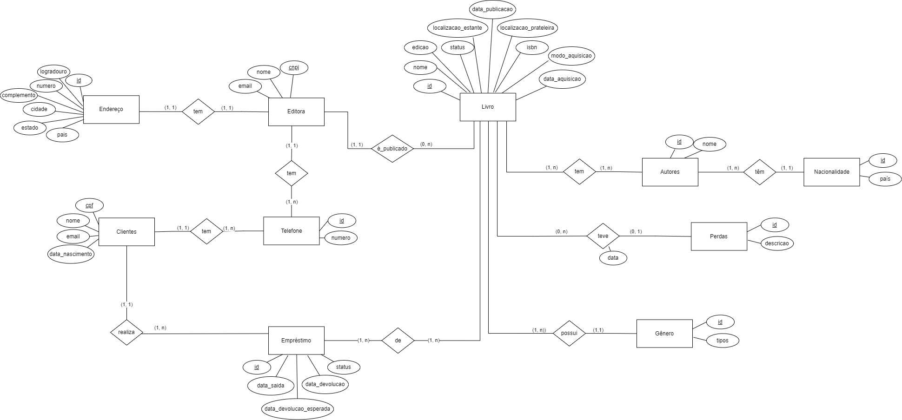
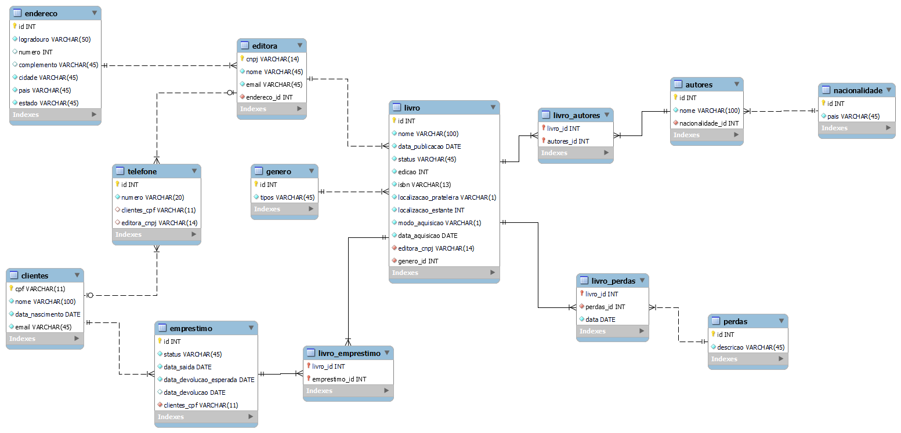

# Projeto Biblioteca em SQL
Projeto desenvolvido para armazenar dados de uma biblioteca fictícia, por meio do desenvolvimento de um banco de dados relacional. Para isso, foram criados: o modelo conceitual, o modelo lógico e o projeto físico.

Para a definição da estrutura do banco de dados foram utilizadas declarações DDL (exemplo: create, alter e drop) e para a manipulação dos dados foram utilizadas declarações DML (exemplo select, insert, delete e update).

## 📌 Índice
- <a href = "#modelo-conceitual">Modelo Conceitual</a>
- <a href = "#modelo-logico">Modelo Lógico</a>
- <a href = "#tecnologia">Tecnologia utilizada</a>
- <a href = "#autores">Autores</a>

## 📂 Modelo Conceitual

## 📂 Modelo Lógico

## Tecnologia Utilizada

## 📝 Autores
- Isabela Maria Leonardo
- Carolina Beltrame
- Luiz Alberto Lucchetta